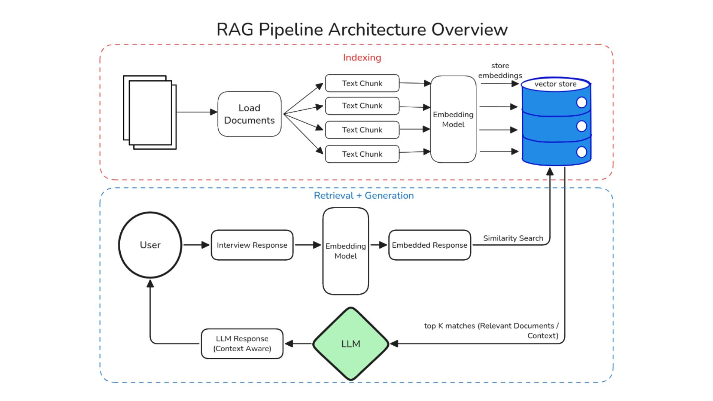
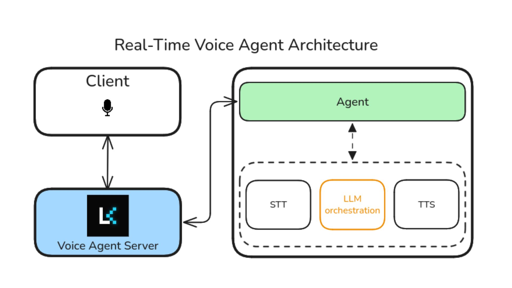

# Get-Me-Hired

A unified platform with adaptive voice-based AI interviews, real-time performance analytics, integrated coding assessments, and community knowledge sharing. Candidates receive quantifiable feedback on technical skills, communication, confidence, and behavioral patterns.

---

## The Problem

Fresh graduates fail interviews not due to skill gaps, but due to:

- Poor confidence & communication
- No realistic practice or actionable feedback
- Scattered preparation across multiple platforms

The Hiring Crisis
*Candidates:* struggle with confidence & lack AI-powered interview preparation
*Companies:* face talent shortages, bias & inefficient hiring processes

- Why It Matters: 64% of companies use AI in hiring, but candidates lack AI-powered preparation. 45% fail interviews due to poor communication and confidence, not technical ability.
Students, recruiters, colleges, underrepresented communities lacking equitable access to quality coaching

---

## Features

- Contextual RAG-Powered Conversations
- Interactive AI Avatar Interviewer
- Resume Upload
- Live Code Editor
- Code analysis
- AI-Driven Performance Feedback

---

## System Architecture

## Project setup

1. [Backend setup](/backend/README.md)
